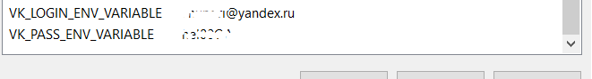
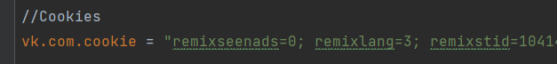

# Что сделать перед запуском автотестов
1. Параметры, которые могут меняться/должны быть секьюрны, хранятся в конфигах application.conf и 
reference.conf. Библиотека typesafe.config по дефолту смотрит на application.conf, однако при
наличии любого другого конфига берет данные из него(в моём случае из reference.conf)

Конфиг reference.conf гит'игнорится и хранится в проекте только локально, поэтому для запуска тестов
вам нужно прописать логин и пароль в environment variables вот так:

После добавления системных переменных обязательно нужно **ПЕРЕЗАГРУЗИТЬ** Intellij Idea.

2. Перед запуском API тестов необходимо установить актуальное значение Cookie для
id.vk.com в application.conf. Найти можно в файле ?act=web_token в Request c заголовком "cookie".

3. Если при сборке проекта возникает ошибка **BUG! exception in phase 'semantic analysis' in source unit '_BuildScript_' Unsupported class file major version 61**
, необходимо в Setting -> Build -> Build Tools -> Gradle -> Gradle JVM установить более старую версию JDK (например 8 или 11).

4. Проверить, что установлен плагин Lombok

# Чек лист для раздела Personal Data

Цель - проверить корректность обновления пользовательских данных и их сохранения, а также
на отмену изменений.

Основные смоук тесты рекомендуется автоматизировать, остальное проверять руками, 
поскольку при увеличении основных бизнес сценариев проект будет сильно разрастаться,
однако это зависит от конкретной ситуации.

## Моменты, которые надо учесть перед организацией тестирования (учитывая текущее состояние веб-ресурса id.vk.com):

1. Поскольку dropdown'ы с датами на FE:
- содержат ограниченные и корректные по значению величины(нет 13-го месяца, 1240 года и 45 дней)
- изменение данных будет происходить ТОЛЬКО со стороны UI  

имеет смысл проверить дату, месяц и год только на корректность изменения и сохранения в базе.
На поля First name и Last name, помимо изменения и сохранения, следует наложить негативные проверки.

2. А есть ли документация API?

3. По-видимому, сервер позволяет сохранять только тот круг имен и фамилий, который определён в базе.
Есть неочевидные проблемы с их сохранением (даже с корректными тестовыми данными): если запрос
на обновление не отклоняется сразу и появляется на UI, сообщение "Ваш запрос отправлен на верификацию"
тоже исчезает и не ясно, будут ли они сменены вообще и когда.

## Frontend тесты

### 1. Смоук проверки - АВТОМАТИЗИРУЕМ (проверяем жизнеспособность важнейших функций страницы)
1.1 Изменяем ВСЮ возможную инфо о пользователе, сохраняем. Проверяем, что после 
обновления страницы изменения применились. Ожидаемый результат:
- имя и фамилия остались прежними
- дата рождения изменилась на новую 
- присутствует сообщение об "отправке запроса на изменение имени и фамилии"
 
1.2 Изменяем ВСЮ возможную инфо о пользователе, сохраняем. Отменяем запрос на обновление.
Ожидаемый результат:
- после обновления страницы данные остались как прежде без изменений

1.3 На личной странице vk.com в настройках можно выбрать язык профиля, при этом на странице
id.vk.com интерфейс меняется на русский. Руками можно проверить локализацию.

### 2. Позитивные проверки (ручное тестирование)
Проверяем, что:
 - если данные НЕ менялись/были удалены и введены такие же, как прежде, кнопка Save
должна быть неактивной
 - имя/фамилию можно сохранить на других языках, французский, испанский и проч.
(ЕСЛИ это предусмотрено бизнес логикой)
 - можно вернуться на основную страницу vk.com и проверить, подтягиваются ли новые данные

### 3. Негативные проверки (ручное тестирование)
Проверяем, что: 
 - нельзя сохранить имя и фамилию, указав их на разных языках
 - и имя, и фамилия не могут быть сохранены, если оба не указаны с заглавной буквы
 - имя/фамилия не могут иметь больше двух заглавных букв
 - имя/фамилия не могут содержать буквы на разных языках
 - имя/фамилия не могут содержать символы и цифры
 - имя/фамилия имеют длину согласно тех. документации(если такая есть)
 - при незаполненном имени/фамилии кнопка Save неактивна
 - нельзя изменить пол, если в базе указано, какому полу соответствует имя (в идеальном мире)
 - судя по тому, что UI не позволяет сохранить пользователя младше 14 лет, есть возрастные ограничения.
Следовательно, надо проверить граничные верхние значения, например когда человеку ровно 14 лет в текущий день и
за 1 день до дня рождения.
 - невозможно менять имя и фамилию чаще, чем указано в тех. документации

## API тесты

### 1. Смоук проверки - АВТОМАТИЗИРУЕМ (сценарии, как и для тестирования UI)

1.1 Отправляем запрос со ВСЕЙ обновленной инфо о пользователе, сохраняем. Проверяем, что после
обновления страницы изменения применились.

1.2 Отправляем запрос со ВСЕЙ обновленной инфо о пользователе, сохраняем. Отменяем запрос на обновление.
Проверяем в ответе, что имя и фамилия еще не сменились, а даты поменялись. Сам запрос находится в обработке.

### 2. Позитивные проверки

Проверяем, что:
 - возможно менять имя и фамилию несколько раз подряд (не чаще, чем указано в тех. документации, т.е.
отправка нескольких запросов на обновление данных с учетом допустимого тайминга)

### 3. Негативные проверки (отправляем запросы на сервер, убеждаемся, что получаем корректные статус коды и сообщения об ошибках)

Все основные запросы это POST, проверяем:
 - обязательность параметров, смотрим реакцию сервера на отправку 
запросов без некоторых/всех параметров (если есть API документация)
 - отправку некорректных тестовых параметров в form-data
 - тестирование заголовков на обязательность (если есть API документация)
 - тестирование заголовков (например регистрозависимость, некорректные данные, спецсимволы и т.д.)
 - отправку запросов на обновление несколько раз подряд (чаще, чем указано
в тех. документации)
